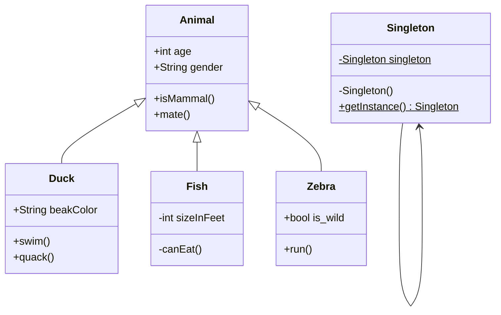
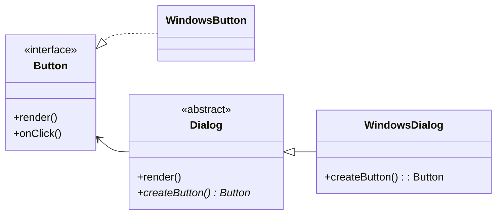
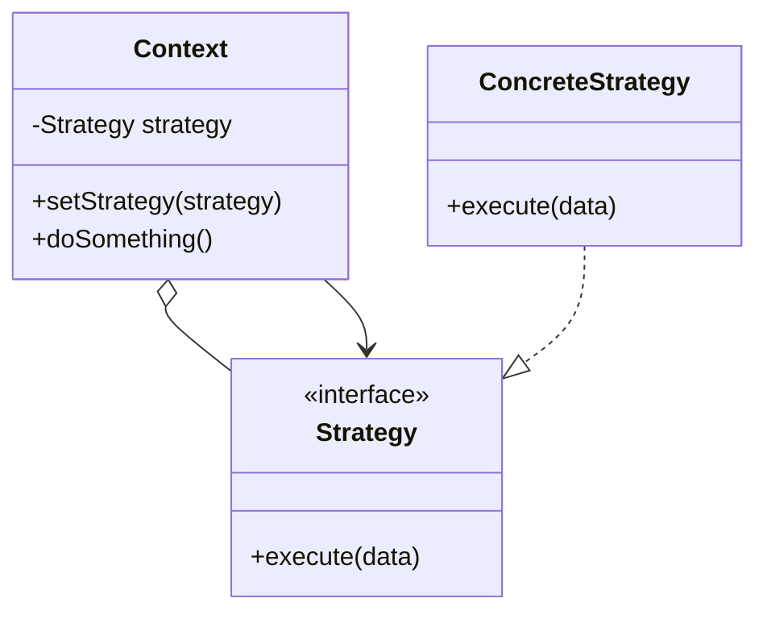
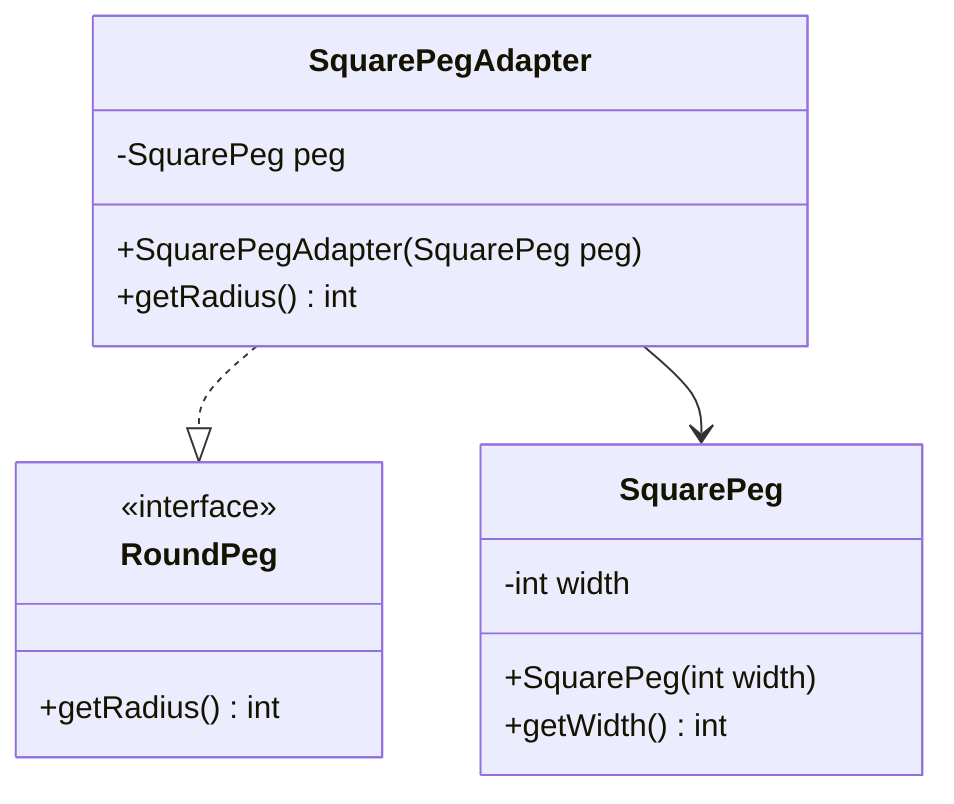
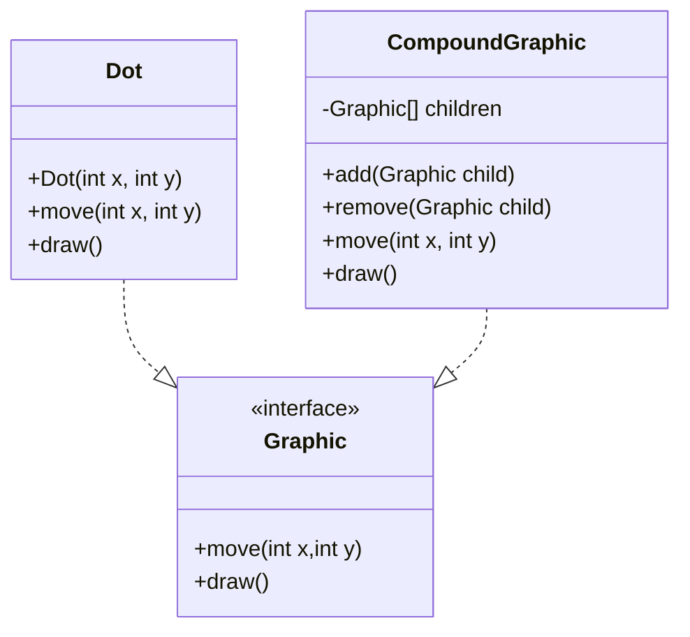

# parseidon

Knex.js based query builder to interpret design patterns in MermaidJS.

```
// Test string
const input = "classDiagram\r\n  Singleton-->Singleton\r\n SecondSingleton-->SecondSingleton\r\n   Animal <|-- Duck\r\n    Animal <|-- Fish\r\n    Animal <|-- Zebra\r\n  Animal : +int age\r\n    Animal : +String gender\r\n    Animal: +isMammal()\r\n    Animal: +mate()\r\n    class Duck{\r\n        +String beakColor\r\n        +swim()\r\n        +quack()\r\n    }\r\n    class Fish{\r\n        -int sizeInFeet\r\n        -canEat()\r\n    }\r\n    class Zebra{\r\n        +bool is_wild\r\n        +run()\r\n    }\r\n    class Singleton{\r\n        -Singleton singleton$\r\n        -Singleton()\r\n        +getInstance()$ Singleton\r\n   }\r\n    class SecondSingleton{\r\n        -SecondSingleton singleton$\r\n        -SecondSingleton()\r\n        +getInstance()$ SecondSingleton\r\n   }";

```

# Design Patterns

For the moment, ParseidonJS supports these design patterns software design patterns:

## Singleton

### Steps

1. Singleton class has private static instance of own class
2. Singleton class has a private constructor
3. Singleton class has public static method returning the singleton class instance
4. There is no instance of the singleton class in any other class



```
 classDiagram
    Animal <|-- Duck
    Animal <|-- Fish
    Animal <|-- Zebra
    Singleton --> Singleton
    Animal : +int age
    Animal : +String gender
    Animal: +isMammal()
    Animal: +mate()
    class Duck{
        +String beakColor
        +swim()
        +quack()
    }
    class Fish{
        -int sizeInFeet
        -canEat()
    }
    class Zebra{
        +bool is_wild
        +run()
    }
    class Singleton{
      -Singleton singleton$
      -Singleton()
      +getInstance()$ Singleton    
    }
```

## Factory Method

### Steps

1. Have a "product" interface implemented by at least 1 "product'
2. Have an abstract "creator" class with abstract method that returns "product" interface and at least 1 other method
3. Have at least one class inheriting from "creator" class 


```
 classDiagram 
direction RL
    class Dialog {
<<abstract>>
+render()
+createButton()* Button
}
class Button {
<<interface>>
+render()
+onClick()
}
class WindowsDialog {
+createButton(): Button
}

WindowsDialog --|> Dialog
WindowsButton ..|> Button
Dialog --> Button
```

## Strategy 

### Steps

1. Strategy interface with 1 method ( Strategy method )
2. Context class with private Strategy interface member
3. One class implementing the Strategy interface


``` 
 classDiagram
Context o-- Strategy
Context --> Strategy
ConcreteStrategy ..|> Strategy
class Strategy {
<<interface>>
+execute(data)
}
class ConcreteStrategy {
+execute(data)
}
class Context {
-Strategy strategy
+setStrategy(strategy)
+doSomething()
}    
```

## Adapter

### Steps

1. Adapter class that associates with the service and implements the client interface
2. Service class, the client can't use it directly. Adapter class has an instance of it


```
 classDiagram
SquarePegAdapter ..|> RoundPeg
SquarePegAdapter --> SquarePeg

class SquarePegAdapter {
-SquarePeg peg
+SquarePegAdapter(SquarePeg peg)
+getRadius() int
}
class SquarePeg {
-int width
+SquarePeg(int width)
+getWidth() int
}
class RoundPeg {
<<interface>>
+getRadius() int
}
```

## Composite

### Steps

1. Component interface with at least one method
2. Two classes implementing the Component interface (Leaf and Container)
3. One class(Container) with an array of interface type, methods to add and remove members of the array



``` 
 classDiagram
Dot ..|> Graphic
CompoundGraphic ..|> Graphic
class Graphic {
<<interface>>
+move(int x,int y)
+draw()
}
class Dot {
+Dot(int x, int y)
+move(int x, int y)
+draw()
}
class CompoundGraphic {
-Graphic[] children
+add(Graphic child)
+remove(Graphic child)
+move(int x, int y)
+draw()
}
```